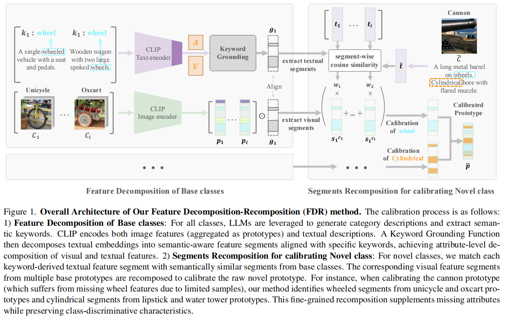

# Feature Decomposition-Recomposition (FDR) for Few-Shot Class-Incremental Learning

Official implementation of ICCV 2025 paper:  
**Feature Decomposition-Recomposition in Large Vision-Language Model for Few-Shot Class-Incremental Learning**  
(Paper ID 13700)

> **Abstract**:  
> Few-Shot Class-Incremental Learning (FSCIL) focuses on incrementally learning novel classes using only a limited number of samples from novel classes, which faces dual challenges: catastrophic forgetting of previously learned classes and over-fitting to novel classes with few available samples. Recent advances in large pre-trained vision-language models (VLMs), such as CLIP, provide rich feature representations that generalize well across diverse classes. Therefore, freezing the pre-trained backbone and aggregating class features as prototypes becomes an intuitive and effective way to mitigate catastrophic forgetting.However, this strategy fails to address the overfitting challenge, and the prototypes of novel classes exhibit semantic bias due to the few samples per class. To address these limitations, we propose a semantic **Feature Decomposition-Recomposition (FDR)** method based on VLMs. Firstly, we decompose the CLIP features into semantically distinct segments guided by text keywords from base classes. Then, these segments are adaptively recomposed at the attribute level given text descriptions, forming calibrated prototypes for novel classes. The recomposition process operates linearly at the attribute level but induces nonlinear adjustments across the entire prototype. This fine-grained and non-linear recomposition inherits the generalization capabilities of VLMs and the adaptive recomposition ability of base classes, leading to enhanced performance in FSCIL. Extensive experiments demonstrate our method's effectiveness, particularly in 1-shot scenarios where it achieves improvements between 6.70%~19.66% for novel classes over state-of-the-art baselines on CUB200. 

## 🚀 Key Features
- **Semantic Feature Decomposition**:  
  Uses LLM-generated keywords to decompose CLIP features into attribute-aligned segments
- **Adaptive Recomposition**:  
  Calibrates novel class prototypes by recomposing relevant segments from base classes
- **Fine-grained Calibration**:  
  Attribute-level adjustments mitigate prototype bias while preserving class discriminability
- **Plug-and-Play**:  
  Works with frozen CLIP backbone, requiring no retraining during incremental phases
- **SOTA Performance**:  
  Outperforms existing methods in both 1-shot and 5-shot scenarios across multiple benchmarks

## 📊 Results Highlights
**CUB200-1-shot (Novel Class Accuracy - NAcc)**
| Session | TEEN [20] | FDR (Ours) | Δ       |
| ------- | --------- | ---------- | ------- |
| 1       | 35.16%    | **54.82%** | +19.66% |
| 3       | 30.00%    | **39.74%** | +9.74%  |
| 10      | 31.56%    | **38.40%** | +6.84%  |

**IN1K-FSCIL-1-shot (NAcc)**
| Session | TEEN [20] | FDR (Ours) | Δ      |
| ------- | --------- | ---------- | ------ |
| 1       | 24.20%    | **31.48%** | +7.28% |
| 10      | 20.27%    | **25.59%** | +5.32% |

## 🛠️ Installation
```bash
git clone https://github.com/yourusername/FDR-FSCIL.git
cd FDR-FSCIL
conda create -n fdr python=3.8
conda activate fdr
pip install -r requirements.txt
```

## 🏃 Quick Start
1. **Prepare datasets** (CUB200/ImageNet):
```bash
python data/prepare_cub.py --data_root /path/to/cub
```

2. **Run incremental learning**:
```python
python script/cub200/FDR.py
```

## 🧩 Method Overview



*Feature Decomposition-Recomposition workflow:  
(1) Semantic decomposition of base prototypes using LLM keywords  
(2) Attribute-level recomposition for novel class calibration*


## 📜 Citation
```bibtex
@inproceedings{fdr2025iccv,
  title={Feature Decomposition-Recomposition in Large Vision-Language Model for Few-Shot Class-Incremental Learning},
  author={Anonymous},
  booktitle={Proceedings of the IEEE/CVF International Conference on Computer Vision},
  year={2025},
  note={Paper ID 13700}
}
```

## 🤝 Contributing
Contributions are welcome! Please open an issue or submit a PR.

## 📧 Contact
For questions, please contact: zongyao.xue@vipl.ict.ac.cn
